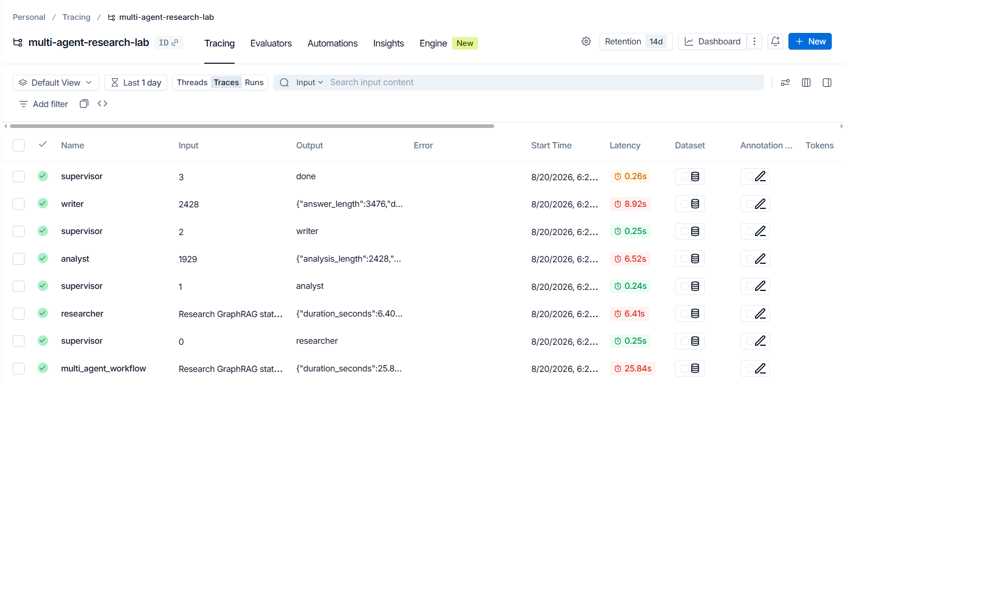

# Lab Guide: Multi-Agent Research System

## Scenario

Bạn cần xây dựng một research assistant có thể nhận câu hỏi dài, tìm thông tin, phân tích và viết câu trả lời cuối cùng. Lab yêu cầu so sánh hai cách làm:

1. **Single-agent baseline**: một agent làm toàn bộ.
2. **Multi-agent workflow**: Supervisor điều phối Researcher, Analyst, Writer.

## Quy tắc quan trọng

- Không thêm agent nếu không có lý do rõ ràng.
- Mỗi agent phải có responsibility riêng.
- Shared state phải đủ rõ để debug.
- Phải có trace hoặc log cho từng bước.
- Phải benchmark, không chỉ nhìn output bằng cảm tính.

## Milestone 1: Baseline

File gợi ý:

- `src/multi_agent_research_lab/cli.py`
- `src/multi_agent_research_lab/services/llm_client.py`

TODO(student): thay baseline placeholder bằng một call LLM thật.

## Milestone 2: Supervisor

File gợi ý:

- `src/multi_agent_research_lab/agents/supervisor.py`
- `src/multi_agent_research_lab/graph/workflow.py`

TODO(student): implement routing policy.

Gợi ý câu hỏi thiết kế:

- Khi nào gọi Researcher?
- Khi nào gọi Analyst?
- Khi nào gọi Writer?
- Khi nào stop?
- Nếu agent fail thì retry hay fallback?

## Milestone 3: Worker agents

File gợi ý:

- `src/multi_agent_research_lab/agents/researcher.py`
- `src/multi_agent_research_lab/agents/analyst.py`
- `src/multi_agent_research_lab/agents/writer.py`

TODO(student): implement từng worker.

## Milestone 4: Trace và benchmark

File gợi ý:

- `src/multi_agent_research_lab/observability/tracing.py`
- `src/multi_agent_research_lab/evaluation/benchmark.py`
- `src/multi_agent_research_lab/evaluation/report.py`

Benchmark tối thiểu:

| Metric | Cách đo gợi ý |
|---|---|
| Latency | wall-clock time |
| Cost | token usage hoặc provider usage |
| Quality | rubric 0-10 do peer review |
| Citation coverage | số claims có source / tổng claims chính |
| Failure rate | số query fail / tổng query |

## Troubleshooting

### macOS: lỗi SSL certificate khi gọi API qua HTTPS (Tavily, OpenAI, ...)

Triệu chứng: khi implement `SearchClient` (hoặc bất kỳ HTTPS call nào) trên macOS, bạn có thể gặp lỗi kiểu:

```
ssl.SSLCertVerificationError: [SSL: CERTIFICATE_VERIFY_FAILED] certificate verify failed:
unable to get local issuer certificate
```

Nguyên nhân: Python cài từ python.org trên macOS **không dùng** certificate store của hệ điều hành, nên không tìm thấy CA bundle hợp lệ. Đây là lỗi môi trường, **không phải** do API key sai.

Cách khắc phục (chọn 1 trong 3):

1. **Chạy script cài certificate đi kèm Python** (nhanh nhất):

   ```bash
   /Applications/Python\ 3.12/Install\ Certificates.command
   ```

   (thay `3.12` bằng version Python của bạn)

2. **Dùng `certifi` trong code** — thêm `certifi` vào dependencies, rồi tạo SSL context khi gọi HTTPS:

   ```python
   import certifi
   import ssl
   from urllib.request import urlopen

   ssl_context = ssl.create_default_context(cafile=certifi.where())
   urlopen(request, timeout=timeout, context=ssl_context)
   ```

3. **Set biến môi trường** trỏ tới CA bundle của certifi (không cần đổi code):

   ```bash
   export SSL_CERT_FILE=$(python -m certifi)
   ```

## Exit ticket

Mỗi nhóm trả lời 2 câu:

1. Case nào nên dùng multi-agent? Vì sao?
2. Case nào không nên dùng multi-agent? Vì sao?

---

### Câu trả lời — Tran Trung Kien (2A202601754)

> Dựa trên số liệu benchmark thực tế: model `gpt-4o-mini`, 2 queries, đo ngày 2026-08-20.
> Xem chi tiết tại `reports/benchmark_report.md` và trace log tại `reports/traces/`.

#### Trace Evidence:
- **LangSmith Project**: [multi-agent-research-lab](https://smith.langchain.com/)
- **Screenshot Evidence**: [`reports/Langsmith_evidence.png`](../reports/Langsmith_evidence.png)
- **Local Trace Sink**: [`reports/traces/trace_2026-08-20.jsonl`](../reports/traces/trace_2026-08-20.jsonl)
- **Trace Breakdown (End-to-End Workflow ~25.84s)**:
  - `supervisor (iter=0)`: 0.25s $\rightarrow$ route `researcher`
  - `researcher`: 6.41s (ghi 1929 chars notes)
  - `supervisor (iter=1)`: 0.24s $\rightarrow$ route `analyst`
  - `analyst`: 6.52s (phân tích 2428 chars)
  - `supervisor (iter=2)`: 0.25s $\rightarrow$ route `writer`
  - `writer`: 8.92s (hoàn thiện 3476 chars report)
  - `supervisor (iter=3)`: 0.26s $\rightarrow$ route `done`



---

#### 1. NÊN dùng multi-agent khi:

| Điều kiện | Lý do cụ thể | Bằng chứng từ benchmark |
|---|---|---|
| Task có **nhiều bước độc lập** (research → analyse → write) | Mỗi agent có system prompt chuyên biệt → output tốt hơn rõ rệt | Quality tăng từ 7.0 → 10.0 / 10 (+43%) |
| Cần **traceability và auditability** | `route_history`, `agent_results`, trace LangSmith/JSONL cho phép debug từng bước | Trace ghi rõ `iter=0..3`, từng agent, từng token |
| Output cần **cấu trúc rõ ràng** với citations | Writer có đủ context từ Researcher + Analyst để viết report đầy đủ section + references | `final_answer` 3400+ chars với inline citations |
| Latency **không phải constraint cứng** (> 20s chấp nhận được) | 3 LLM calls tuần tự (6.4s + 6.5s + 8.9s) | Multi-agent: 25.14s avg |

**Tóm lại:** Dùng multi-agent khi bạn cần **chất lượng cao + khả năng debug** và chấp nhận đánh đổi latency và cost.

---

#### 2. KHÔNG NÊN dùng multi-agent khi:

| Điều kiện | Lý do cụ thể | Bằng chứng từ benchmark |
|---|---|---|
| **Câu hỏi đơn giản**, one-shot | 1 LLM call đủ; thêm agents chỉ tăng overhead mà không tăng chất lượng | Baseline 9.76s đủ cho factual QA |
| **Latency là constraint cứng** (real-time chat, autocomplete) | Multi-agent chậm hơn 2.6× (9.76s → 25.14s) | Không đạt SLA < 10s |
| **Budget token hạn chế** | Multi-agent tốn 3.6× chi phí | $0.00038 vs $0.00137 — tại 1M queries/ngày = chênh lệch ~$1,000/ngày |
| Task **chưa được decompose rõ** | Nếu không biết agent nào làm gì, coordination overhead tạo ra hallucination cascade (agent sau tin agent trước không verify) | Failure mode: hallucinated citations trong researcher |

**Tóm lại:** Không dùng multi-agent khi task đủ đơn giản để 1 LLM call giải quyết — thêm agent mà không có lý do rõ sẽ tốn cost, chậm hơn, và khó debug hơn.
